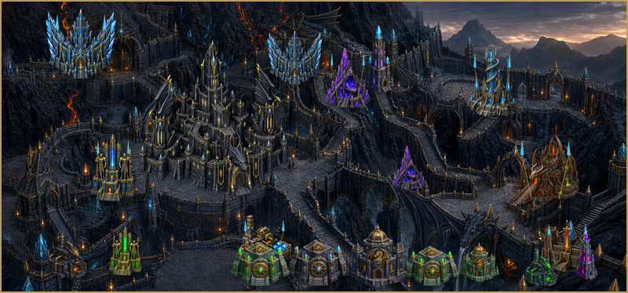

# Dragon Citadel for VCMI

A custom, exceptionally powerful town for Heroes of Might and Magic III running on VCMI.

## Requirements

- a legal copy of Heroes of Might and Magic III: Complete
- VCMI 1.7.0 or newer

## Installation

1. Copy the `dragon-citadel` folder to `Documents\My Games\vcmi\Mods`.
2. Start VCMI Launcher.
3. Enable `Dragon Citadel`.

The mod can also be added as a custom VCMI Launcher repository:

`https://raw.githubusercontent.com/czcmjkfvy4-dotcom/Jakubabuba/main/repository.json`

## Town Identity

Dragon Citadel is intentionally expensive. Its dwellings and army require an immense treasury and rare resources. In return, the town fields titans, magical beasts and several tiers of exceptionally powerful dragons.

Billaden, a diplomacy specialist, is the town's signature hero.

## Information

- Author: Billaden
- Mod creator: Billaden - Jakubabuba
- Mod version: 1.4.2
- Languages: English and Polish
- Mod type: new town

## Polski

### Smocza Cytadela dla VCMI

Autorskie, bardzo potężne miasto do Heroes of Might and Magic III uruchamianego przez VCMI.

### Instalacja

1. Skopiuj folder `dragon-citadel` do `Dokumenty\My Games\vcmi\Mods`.
2. Uruchom VCMI Launcher.
3. Włącz mod `Smocza Cytadela`.

### Charakter miasta

Smocza Cytadela jest celowo droga. Budowa siedlisk i rekrutacja armii wymagają ogromnego skarbca oraz rzadkich surowców. W zamian miasto oferuje tytanów, magiczne bestie i kolejne poziomy wyjątkowo silnych smoków.

Głównym bohaterem miasta jest Billaden, specjalista od dyplomacji.

Projekt fanowski, niekomercyjny i niepowiązany z Ubisoft Entertainment ani właścicielami marki Heroes of Might and Magic.
