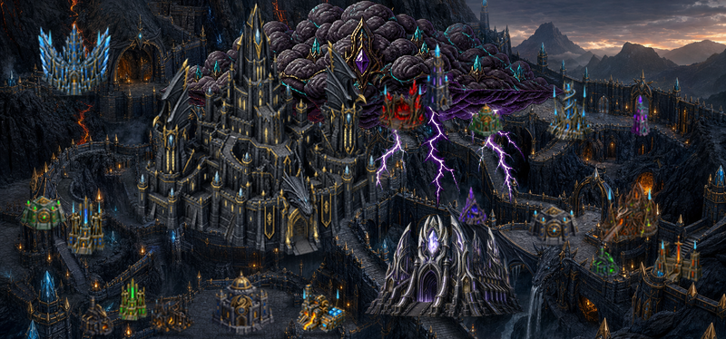

# Dragon Citadel for VCMI

A custom, exceptionally powerful town for Heroes of Might and Magic III running on VCMI.

## Requirements

- a legal copy of Heroes of Might and Magic III: Complete
- VCMI 1.7.0 or newer

## Installation

1. Copy the `dragon-citadel` folder to `Documents\My Games\vcmi\Mods`.
2. Start VCMI Launcher.
3. Enable `Dragon Citadel`.

The mod can also be added as a custom VCMI Launcher repository:

`https://raw.githubusercontent.com/czcmjkfvy4-dotcom/Jakubabuba/main/repository.json`

## Town Identity

Dragon Citadel is intentionally expensive. Its dwellings and army require an immense treasury and rare resources. In return, the town fields titans, magical beasts and several tiers of exceptionally powerful dragons.

Billaden, a diplomacy specialist, is the town's signature hero.

## Balance

- level 1 and 2 recruitment prices are based on comparable Heroes III creature strength
- Titans have reduced early-game statistics, growth of 1 and substantially more expensive dwellings
- level 5-7 dragons remain limited to 1 creature per week after building a Castle
- super dragons require much more gold and rare resources

## Optional All-Towns Bulk Recruit

The separate [Dragon Citadel Bulk Recruit](https://github.com/czcmjkfvy4-dotcom/Dragon-Citadel-Bulk-Recruit/releases/latest) companion for Windows adds two VCMI hotkeys:

- `1`: recruit affordable creatures in global level priority `3 -> 2 -> 1`
- `2`: recruit affordable creatures in global level priority `7 -> 6 -> 5 -> 4`

Each action covers every town owned by the current player, regardless of faction.

## Information

- Author: Billaden
- Mod creator: Billaden - Jakubabuba
- Mod version: 1.4.4
- Languages: English and Polish
- Mod type: new town

## Polski

### Smocza Cytadela dla VCMI

Autorskie, bardzo potężne miasto do Heroes of Might and Magic III uruchamianego przez VCMI.

### Instalacja

1. Skopiuj folder `dragon-citadel` do `Dokumenty\My Games\vcmi\Mods`.
2. Uruchom VCMI Launcher.
3. Włącz mod `Smocza Cytadela`.

### Charakter miasta

Smocza Cytadela jest celowo droga. Budowa siedlisk i rekrutacja armii wymagają ogromnego skarbca oraz rzadkich surowców. W zamian miasto oferuje tytanów, magiczne bestie i kolejne poziomy wyjątkowo silnych smoków.

Głównym bohaterem miasta jest Billaden, specjalista od dyplomacji.

### Balans

- ceny jednostek poziomu 1 i 2 odpowiadają ich rzeczywistej sile na tle innych miast
- Tytani mają osłabione statystyki początkowe, przyrost 1 i znacznie droższe siedliska
- po zbudowaniu Zamku przyrost smoków poziomów 5-7 pozostaje ograniczony do 1 sztuki tygodniowo
- super-smoki wymagają znacznie więcej złota i rzadkich surowców

### Opcjonalny wykup ze wszystkich miast

Osobny dodatek [Dragon Citadel Bulk Recruit](https://github.com/czcmjkfvy4-dotcom/Dragon-Citadel-Bulk-Recruit/releases/latest) dodaje w VCMI dwa skróty:

- `1`: wykup dostępnych jednostek według priorytetu poziomów `3 -> 2 -> 1`
- `2`: wykup dostępnych jednostek według priorytetu poziomów `7 -> 6 -> 5 -> 4`

Każda operacja obejmuje wszystkie miasta posiadane przez gracza, niezależnie od frakcji.

Projekt fanowski, niekomercyjny i niepowiązany z Ubisoft Entertainment ani właścicielami marki Heroes of Might and Magic.
