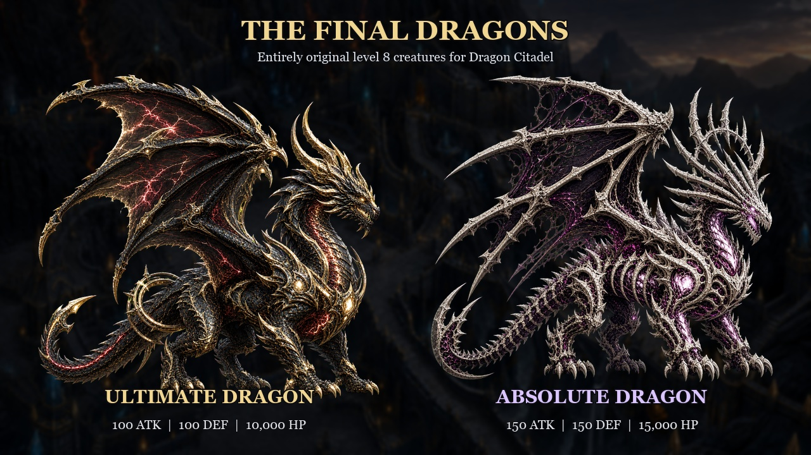
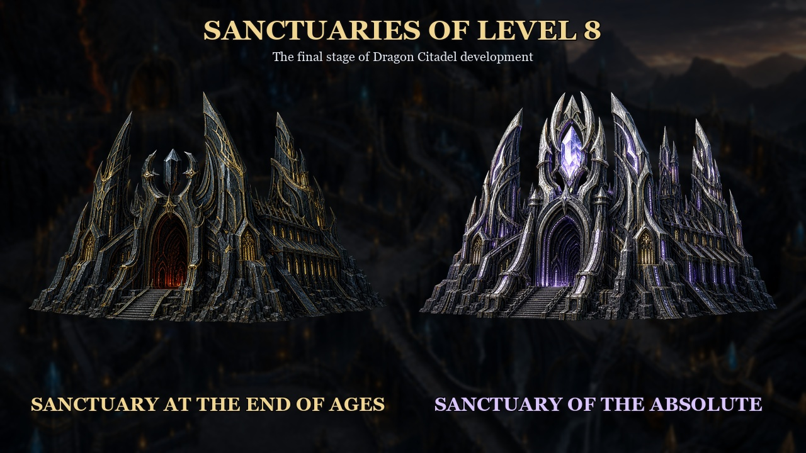

# Dragon Citadel for VCMI

Dragon Citadel is an original, exceptionally expensive endgame town for Heroes of Might and Magic III running on VCMI.

## Requirements

- a legal copy of Heroes of Might and Magic III: Complete
- VCMI 1.7.4 or newer

## Installation

1. Copy the `dragon-citadel` folder to `Documents\My Games\vcmi\Mods`.
2. Start VCMI Launcher.
3. Enable `Dragon Citadel`.

The mod can also be added as a custom VCMI Launcher repository:

`https://raw.githubusercontent.com/czcmjkfvy4-dotcom/Jakubabuba/main/repository.json`

## Level 8: The Final Dragons

Version 1.5.0 adds two entirely original level 8 creatures and two matching town structures.

| Creature | Attack | Defense | Damage | Health | Speed | Recruitment |
| --- | ---: | ---: | ---: | ---: | ---: | --- |
| Ultimate Dragon | 100 | 100 | 1,000-1,500 | 10,000 | 20 | 350,000 gold + 200 of every other resource |
| Absolute Dragon | 150 | 150 | 1,500-2,250 | 15,000 | 30 | 525,000 gold + 300 of every other resource |

Both dragons are immune to level 1-5 magic and reduce melee damage by 100%. VCMI still applies its minimum one point of damage, so ranged creatures remain the intended way to hurt them. They also fly, breathe through two hexes, attack all adjacent enemies, block retaliation, retaliate without limit and regenerate.

The Sanctuary at the End of Ages costs 1,000,000 gold and 500 of every other resource. Its upgrade, the Sanctuary of the Absolute, costs 2,500,000 gold and 800 of every other resource.

A guarded Sanctuary at the End of Ages can appear on the adventure map. It is defended by one Ultimate Dragon and offers the level 8 line after capture. Wandering dragons use a custom 128x128 map animation and always begin in a stack of one.

## VCMI And The Endgame Rules Submod

The public town and its `Dragon Citadel: Endgame Rules` submod load normally through VCMI 1.7.4. BILLADENC4 is a modified VCMI 1.7.4 runtime, not a separate game. Stock VCMI has no data-only rule for monthly town growth or a per-creature joining probability, so it uses the normal weekly fallback for those two details.

When the submod is enabled in VCMI with the matching BILLADENC4 runtime, it enforces the exact endgame rules:

- one Ultimate or Absolute Dragon grows per month
- a neutral sanctuary is defended by exactly one Ultimate Dragon
- wandering level 8 stacks remain at one creature
- only 10% of wandering level 8 positions are eligible to join

The source changes are documented in [BILLADENC4-PATCH.md](BILLADENC4-PATCH.md).

## Optional Creator Tools Submod

`Dragon Citadel: Creator Tools` is included as a normal VCMI submod and is disabled by default. With it enabled and the matching BILLADENC4 runtime:

1. Press `Tab` during a single-player game.
2. Enter `nwcbilladen`.
3. Press `Enter`.

The code multiplies every currently owned resource by 10, up to the VCMI resource cap. It displays `BILLADENC4`, does not set the standard Cheater flag and does not disable score recording.

## Balance

- level 1 and 2 prices are based on comparable Heroes III creatures
- Titans have reduced early-game statistics, growth of 1 and expensive dwellings
- level 5-7 dragons remain limited to 1 creature per week after building a Castle
- the level 8 line requires an endgame treasury and hundreds of every rare resource

## Information

- Author: Billaden
- Mod creator: Billaden - Jakubabuba
- Version: 1.5.0
- Languages: English by default, full Polish support
- Type: new VCMI town

## Polski

### Smocza Cytadela

Smocza Cytadela to autorskie, wyjątkowo drogie miasto końcowej fazy gry do Heroes III uruchamianego przez VCMI.

Wersja 1.5.0 dodaje Smoka Ostatecznego i jego ulepszenie, Smoka Absolutnego. Obie jednostki mają całkowicie nowe grafiki, własne animacje bitwy, portrety i dwukrotnie większe przedstawienie na mapie.

Smok Ostateczny kosztuje 350 000 złota oraz po 200 każdego pozostałego surowca. Smok Absolutny kosztuje 525 000 złota oraz po 300 każdego pozostałego surowca. Są odporne na magię poziomów 1-5 i redukują obrażenia wręcz o 100%; ze względu na minimalne obrażenie silnika skutecznie zranić je mogą przede wszystkim strzelcy.

Sanktuarium Końca Wieków kosztuje 1 000 000 złota i po 500 każdego pozostałego surowca. Sanktuarium Absolutu kosztuje 2 500 000 złota i po 800 każdego pozostałego surowca.

Miasto i submod `Smocza Cytadela: Reguły Końca Gry` są uruchamiane normalnie w VCMI 1.7.4. BILLADENC4 jest zmodyfikowaną wersją VCMI, a nie osobną grą. Z tym silnikiem submod wymusza dokładny przyrost jednej jednostki poziomu 8 na miesiąc, jednego obrońcę siedliska oraz najwyżej 10% szansy na zgodę dzikiego smoka na dołączenie.

Opcjonalny submod `Smocza Cytadela: Narzędzia Twórcy` jest dołączony do paczki, ale domyślnie wyłączony. Kod testowy `nwcbilladen` mnoży aktualny stan wszystkich surowców przez 10, wyświetla napis `BILLADENC4`, nie nadaje standardowego oznaczenia Cheater i nie blokuje wyniku.

Projekt fanowski, niekomercyjny i niepowiązany z Ubisoft Entertainment ani właścicielami marki Heroes of Might and Magic.
